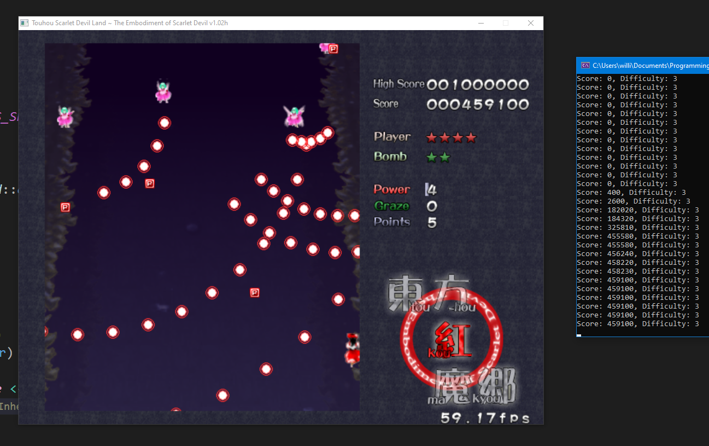
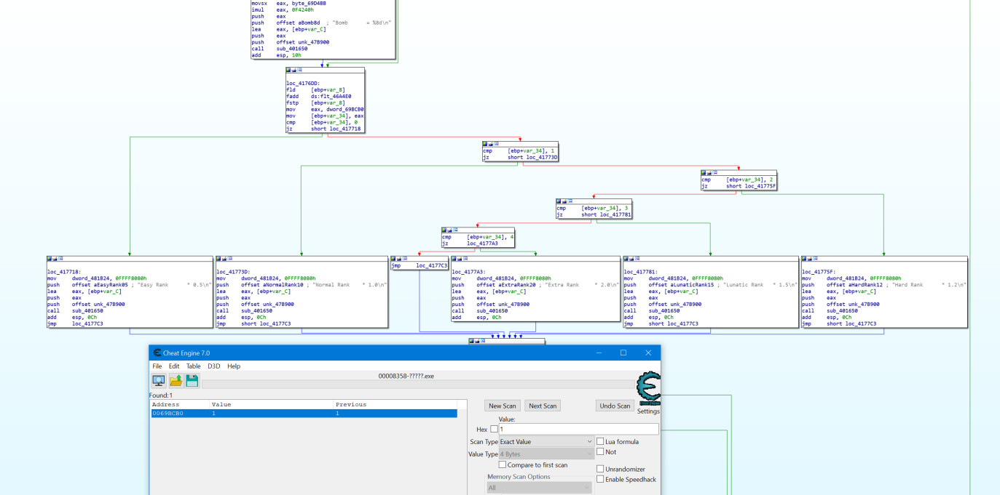

# RansomGame


## Decription
**WARNING**
This application will encrypt your data, **run at your own risk!** Do not close the application or else the encryption key will be *lost*.

RansomGame is an educational app to learn about windows app memory sniffing using ```window.h```.
RansomGame encrypts files using AES and waits for a specific process to be launched (the specific process is given below). Once the process is launched, it looks int its memory for a specific value.

## Decrypt Files
In order to decrypt the files, a score of 0.2 billion must be achieved in the lunatic difficulty.

## Build
The project requires an external library [crypto++](https://github.com/weidai11/cryptopp) in order to build. Be sure to install the submodules with the git command. Once downloaded, the Visual Studio Compiler should automatically compile the binaries of crypto++.

## Game
The required game to unlock the files is [Touhou 6: Koumakyou - The Embodiment of Scarlet Devil ](https://moriyashrine.org/files/file/13-touhou-6-koumakyou-the-embodiment-of-scarlet-devil/).

## Reverse Engineering
I reversed the game's code to find the address of the difficulty index. I searched for a string containing hte word ```Lunatic``` and found this branching. The game loads a ```DWORD``` value from ```0x0069BCB0```. After checking with CheatEngine, this value does change according to the selected difficulty.



## Wanted Features
- [ ] Save AES key to a file
- [ ] Decryptor
- [ ] Bug testing for file handling
- [ ] UI for a cleaner experience
- [ ] Prevent force closing the application
